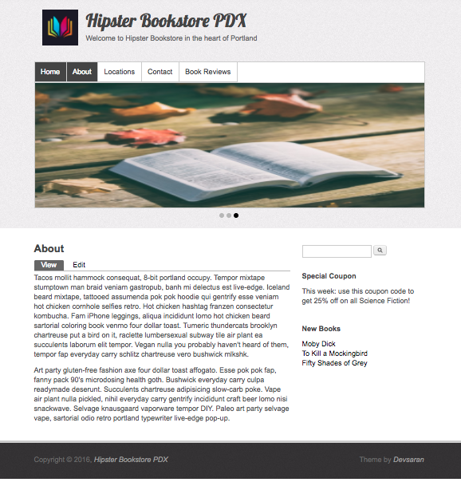

# Bookstore - Drupal

#### _This is a small business website for a bookstore using Drupal 7.53 development environment. November 18, 2016_

#### By _**Stephen Burden**_

## Specifications
* Users with the reviewer role can comment on and create book reviews and edit/delete their content.
* Authenticated users can view book reviews and comment on them and edit/delete their comments.
* Reviewer and Authenticated users can view a special coupon advertised on the front page.

## Prerequisites
You will need MAMP/WAMP installed on your computer.

## Setup/Installation Requirements
* In the Terminal enter `git clone <repository-url>` this repository
* Open MAMP/WAMP, go to ”Preferences" and then "Web Server". Then set your document root folder to point to our project directory, then Start Server.
* In your web browser http://localhost:8888/phpMyAdmin/ and import the `bookstore.sql.zip` file (inside the db-backup directory) into MySQL
* Create a database account (user: `bookstore`, password: `bookstore`) in MySQL
* To view the go to http://localhost:8888 in your web browser_
* Admin user: `bookstore`, password: `bookstore`
* Reviewer user: `reviewer`, password: `reviewer`

## Link
* REPO: https://github.com/spburden/bookstore-drupal
* LIVE: http://dev-pdx-bookstore2.pantheonsite.io/

## Known Bugs
_There are no known bugs with this application._

## Support and contact details
_spburden@hotmail.com_

## Technologies Used
_Drupal 7.52, MAMP, MySQL, CSS_

### License
The MIT License (MIT)

Copyright (c) 2016 **_Stephen Burden_**
